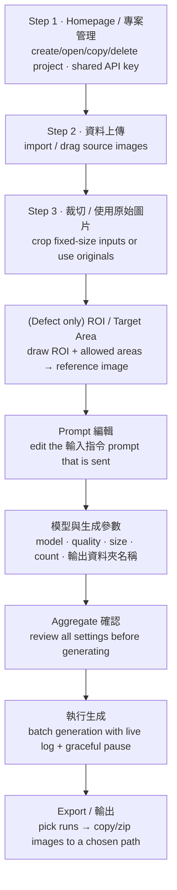

# GPT GenImage UI

`GPT GenImage UI` is a PySide6 desktop application for preparing image inputs,
calling the OpenAI **GPT Image** API, and exporting the generated results as image
datasets. It bundles two closely related workflows ("modes") behind one window:

| Mode | Purpose | API workflow | Inputs |
|------|---------|--------------|--------|
| **Defect** (`Gen Defect`) | Generate new defects onto clean images, guided by an annotation reference | `reference-guided-edit` (two images per call) | `data/crop_image/` + `data/reference_image/` (uploads staged in `data/raw_image/`) |
| **Food** (`Gen Food`) | Generate food appearance/placement variations from a text prompt | `prompt-only-edit` (one image per call) | `data/crop_image/` (uploads staged flat in `data/`) |

Each mode is a guided, multi-step workflow. Per-project inputs, runs, generated
images and state live under `modes/<mode>/project/<project_name>/`. Key execution
nodes and any error/crash diagnostics are appended to a single shared `log.txt` at
the repository root.

> For the detailed, step-by-step guide of each mode, see
> [`modes/defect/README.md`](modes/defect/README.md) and
> [`modes/food/README.md`](modes/food/README.md).

---

## 1. Install

### Windows

```bat
python -m venv .venv
.\.venv\Scripts\activate
python -m pip install --upgrade pip
python -m pip install -r requirements.txt
```

### Linux / macOS

```bash
python -m venv .venv
source .venv/bin/activate
python -m pip install --upgrade pip
python -m pip install -r requirements.txt
```

Key dependencies (full list in [`requirements.txt`](requirements.txt)):

- `PySide6` — desktop UI
- `openai` + `python-dotenv` — GPT Image API calls and `.env` loading
- `pillow`, `numpy`, `opencv-python` — image and annotation processing
- `openpyxl` — `generation_summary.xlsx` per-run report (`.csv` fallback if absent)

---

## 2. Launch

```bash
python launch_ui.py
```

Convenience launchers: `quick_start_ui_windows.bat` (Windows) and
`bash quick_start_ui_linux.sh` (Linux/macOS).

If the launcher reports that `PySide6`/Qt cannot be imported, activate the same
virtual environment where `requirements.txt` was installed and run
`python launch_ui.py` again.

---

## 3. Architecture

`launch_ui.py` is the single entry point. It hosts one window (`UnifiedMainWindow`)
and loads each mode's UI package on demand:

```text
launch_ui.py                       # launcher + single-window host (UnifiedMainWindow)
modes/defect/ui_gpt_defect/app.py  # Defect workflow UI  (ui_gpt_<mode> convention)
modes/food/ui_gpt_food/app.py      # Food workflow UI
modes/<mode>/scripts/              # batch_from_folders.py, run_gpt_image2.py, verify_env.py
```

- The host loads `modes/<mode>/ui_gpt_<mode>/app.py` by file path via `importlib`;
  there is no separate top-level UI package.
- The **Homepage is shared**: it lists every project from both modes (green cards =
  defect, blue cards = food). `新增專案 / New Project` is where you choose the mode,
  and the host switches to that mode's workflow internally.
- The shared `OPENAI_API_KEY` is entered once on the Homepage and stored in a single
  `.env` at the repository root (the same level as `modes/`), shared by both modes —
  it is not duplicated under each mode folder. It starts empty on a fresh install
  until you save a key.
- Normal runs do **not** write `__pycache__`: `launch_ui.py` sets
  `sys.dont_write_bytecode` and the generation subprocesses get
  `PYTHONDONTWRITEBYTECODE=1`.

---

## 4. Workflow Overview

Both modes share the same backbone; **defect** adds one extra annotation step
(`ROI / Target Area`). Step numbers below are the visible, 1-based numbers shown in
the sidebar (defect = 9 steps, food = 8 steps).



Generation calls `modes/<mode>/scripts/batch_from_folders.py`, which spawns one
blocking `run_gpt_image2.py` subprocess per image — **one OpenAI Image Edit API call
per image**. Defect sends two images (clean original + annotation reference); food
sends one image plus the prompt.

The `停止目前程序` button is a **graceful pause, not a kill**: the in-flight image is
allowed to finish (its API call/cost is not wasted) and the next image is simply not
started. The UI signals this by sending a `STOP` line on the batch process's stdin —
no sentinel file is written to disk.

---

## 5. Project Layout & Generated Artifacts

A project folder contains exactly `data/` and `runs/` — **no per-project state file
is written** (the app no longer persists `project_state.json` or any run records):

```text
modes/<mode>/project/<project_name>/
├── data/                         # input images (layout differs by mode, see mode README)
└── runs/
    └── <run_name>/
        ├── Gen_Images/               # every generated image for this run
        ├── generation_summary.xlsx   # per-image table (.csv fallback if openpyxl missing)
        └── prompt.txt                # the prompt actually sent for this run
```

- The only persisted metadata is a single registry,
  `modes/<mode>/project/project_index.json`. Per project it stores id, name, class
  name, mode, model, quality, the per-step completion flags (`completed_steps`,
  true/false for each step) and — for defect — the ROI/Target `regions` geometry.
  The Homepage uses it to list/reopen projects, and reopening restores the exact
  step progress and annotations (still cross-checked against on-disk artifacts).
  Returning to an earlier completed step to **view or select** an existing input does
  **not** change progress; only actually **re-editing** that step's products marks it
  and every later step as not-yet-run.
- Generated image names are `<run_name>-<YYYY>-<MM>-<DD>-<HH>-<mm>-<counter>`; the
  counter never repeats, so previous outputs are never overwritten.
- Export copies the selected runs' images straight to a folder you pick
  (`<project_name>-<timestamp>`, optionally zipped); it does not keep an `exports/`
  folder in the project.
- Duplicating a project copies only its `data/` folder (staged uploads + prepared
  crop inputs), not the generated `runs/`, so every project keeps an independent run
  counter (a copy starts at `run1`).

### What Git ignores

Runtime data and secrets are kept out of source control by the root `.gitignore`:

- `**/project/` — all per-project data (uploads, runs, generated images, the
  `project_index.json` registry) at any depth
- `log.txt` / `*.log` — the shared log
- `.env` / `*.key` — API keys and secrets
- `*.zip` / `*.tar` / `*.tar.gz` — export archives
- `__pycache__/`, `*.py[cod]`, `.venv/` — Python cache and virtual envs

---

## 6. Environment, Secrets & Logging

- The shared API key is stored in a single repo-root `.env` (same level as `modes/`)
  as `OPENAI_API_KEY=...`, shared by both modes. The UI only ever shows a masked
  preview; the key is never committed.
- OpenAI pricing for cost estimation is fetched live with a built-in default
  fallback; nothing is cached to disk (there is no `configs/` folder).
- Logging: the single repo-root `log.txt` records the app startup time on launch,
  per-step events (entering/submitting each step, each ROI/Target box **add or
  delete** with its `(x1,y1,x2,y2 …)` coordinates, generation start/finish/pause),
  and full tracebacks for any uncaught or per-action error (also surfaced to the user
  in a dialog). Merely selecting/viewing an already-framed image is **not** logged.
  On each launch, entries older than **6 months** (day granularity) are automatically
  pruned. There is no per-project or top-level `logs/` folder.

---

## 7. Developer Checks

```bash
python -m compileall modes launch_ui.py   # verify Python syntax
git status                                # review working tree
git diff --stat
```
