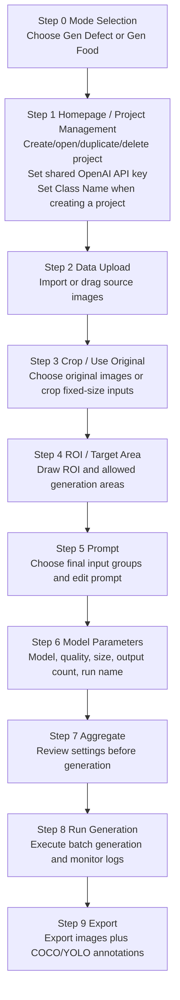

# GPT GenImage UI

`GPT GenImage UI` is a PySide6 desktop workflow for preparing image-generation
inputs, calling the OpenAI GPT Image API, and exporting generated results as image
datasets.

The launcher opens a single desktop window. `Step 0` is the mode selector inside
that same window:

- `Gen Defect` opens the defect workflow.
- `Gen Food` opens the food workflow.

After a mode is selected, the same top-level window is reused for that mode's
guided workflow. The mode homepage is shown as `Step 1`, followed by the remaining
workflow steps. Project-specific inputs, configuration, runs, exports, and logs are
kept under each mode's runtime project folder.

---

## 1. Install

### Windows

```bat
python -m venv .venv
.\.venv\Scripts\activate
python -m pip install --upgrade pip
python -m pip install -r requirements.txt
```

### Linux / macOS

```bash
python -m venv .venv
source .venv/bin/activate
python -m pip install --upgrade pip
python -m pip install -r requirements.txt
```

Required packages are listed in `requirements.txt` and include:

- `PySide6` for the desktop UI
- `openai` and `python-dotenv` for GPT Image API calls
- `pillow`, `numpy`, and `opencv-python` for image and mask processing

---

## 2. Launch

```bash
python launch_ui.py
```

Convenience launchers are also available:

```bat
quick_start_ui_windows.bat
```

```bash
bash quick_start_ui_linux.sh
```

If the launcher reports that `PySide6` or Qt cannot be imported, activate the same
virtual environment where `requirements.txt` was installed and run `python launch_ui.py`
again.

---

## 3. Current Workflow



The defect mode shows the full `Step 1` through `Step 9` workflow. The food mode
uses the same single-window mode selector and keeps its own visible workflow, with
food-specific target-area handling. Internally, the mode applications keep older
step indexes for compatibility with existing project state files.

---

## 4. Step Details

### Step 0: Mode Selection

- Choose `Gen Defect` or `Gen Food`.
- The selected mode is loaded into the same window instead of opening a second
  workflow window.

### Step 1: Homepage / Project Management

- Create a new project with both `Project Name` and `Class Name`.
- Save or replace the shared `OPENAI_API_KEY` used by all projects.
- Open, duplicate, or delete existing project cards.
- Duplicating a project copies its project state and class workspace artifacts so the
  new card opens with the same existing content.
- Homepage project cards use green for defect projects and blue for food projects.
- Project names must be unique.
- Reopening a project returns to the mode homepage while preserving completed-step state and
  existing artifacts.

### Step 2: Data Upload

- Import source images through the file picker or drag-and-drop.
- Uploaded originals are stored under:

```text
modes/defect/project_defect/<project_name>/data/00_raw_images/<class_name>/
modes/food/project_food/<project_name>/data/00_raw_images/<class_name>/
```

### Step 3: Crop / Use Original

- Either use original images directly or crop fixed-size inputs.
- Crop width and height are UI input dimensions for preparing downstream inputs.
- Existing generation runs and exports are preserved when adding more inputs.
- Prepared inputs are stored under:

```text
modes/defect/project_defect/<project_name>/data/01_inputs/<class_name>/images/
modes/food/project_food/<project_name>/data/01_inputs/<class_name>/images/
```

### Step 4: ROI / Target Area

- Draw one or more ROI rectangles for original defect locations.
- Draw Target Area regions where new defects may be generated.
- Target Area supports rectangle and polygon drawing.
- In selection mode, ROI and rectangular Target Area boxes can be resized with corner
  and edge handles.
- Step 3 auto-saves region files and masks after edits.
- ROI masks and Target Area masks are stored under:

```text
modes/defect/project_defect/<project_name>/data/01_inputs/<class_name>/masks/
modes/defect/project_defect/<project_name>/data/01_inputs/<class_name>/target_area_masks/
modes/defect/project_defect/<project_name>/data/01_inputs/<class_name>/regions/
modes/food/project_food/<project_name>/data/01_inputs/<class_name>/target_area_masks/
modes/food/project_food/<project_name>/data/01_inputs/<class_name>/regions/
```

Useful shortcuts in this step include:

- `R`: draw ROI
- `S`: select ROI
- `T`: draw rectangular Target Area
- `L`: draw polygon Target Area
- `Y`: select Target Area
- `A` / `D`: delete all / selected ROI
- `G` / `H`: delete all / selected Target Area
- `Up` / `Down`: switch image

### Step 5: Prompt

- Choose the final image groups used for generation.
- Use Ctrl/Shift multi-select; the UI limits a batch to at most 16 groups.
- Edit a custom prompt or apply a template.
- The final prompt is no longer combined with ROI / Target Area coordinate text. ROI and Target Area positions are provided visually through a second annotation-reference input image during generation.
- Prompt configuration is stored under:

```text
modes/defect/project_defect/<project_name>/configs/classes/<class_name>/prompt.txt
modes/food/project_food/<project_name>/configs/classes/<class_name>/prompt.txt
```

### Step 6: Model Parameters

Available models:

- `gpt-image-2`
- `gpt-image-1.5`
- `gpt-image-1`
- `gpt-image-1-mini`

The UI validates output size rules before generation. For `gpt-image-2`, output
dimensions must satisfy the current app checks, including 16-pixel multiples, valid
aspect ratio, and supported total pixel range.

### Step 7: Aggregate

- Review the selected project, class, image groups, ROI/Target Area coverage, prompt,
  model, quality, size, output count, and run name.
- The aggregate log is written under the current project logs folder.

### Step 8: Run Generation

- Executes `scripts/batch_from_folders.py`, which calls `scripts/run_gpt_image2.py` with `--workflow reference-guided-edit`.
- Uses the shared API key saved from the mode homepage.
- Sends two images to GPT Image: Image 1 is the clean original; Image 2 is an ROI / Target Area annotation reference.
- Does not send ROI / Target Area coordinates in the prompt and does not use the ROI / Target Area as an OpenAI API mask in this default UI workflow. The stored masks are used only to render Image 2.
- Shows live logs and generation progress.
- Generation outputs are written under:

```text
modes/defect/project_defect/<project_name>/runs/<class_name>/<run_name>/
modes/food/project_food/<project_name>/runs/<class_name>/<run_name>/
```

Each run keeps final generated images plus metadata such as prompts, placement records,
bounding boxes, and logs. Temporary masks and previews are cleaned unless intermediate
files are explicitly kept.

### Step 9: Export

- Defect mode shows this page as `Step 9`; food mode shows its final export page as
  `Step 8` while keeping compatible internal state indexes.
- Exports the current run or all runs for the class. Selecting all runs writes a
  merged `all_runs` export folder for that class.
- In the export-planning panel, the export-scope dropdown shares the top row with the
  refresh button; the COCO format checkbox sits in the left column and the YOLO format
  checkbox sits directly beneath the export-scope dropdown, on the same row as COCO.
- Writes normalized output folders under:

```text
modes/defect/project_defect/<project_name>/exports/<class_name>/<run_name>/
modes/food/project_food/<project_name>/exports/<class_name>/<run_name>/
modes/defect/project_defect/<project_name>/exports/<class_name>/all_runs/
modes/food/project_food/<project_name>/exports/<class_name>/all_runs/
```

- Can copy generated images and create COCO / YOLO annotation files.
- Export bounding boxes are scaled back to the final exported image coordinate system.

---

## 5. Project Files and Generated Artifacts

Runtime artifacts are intentionally ignored by Git:

- `project/`
- `modes/defect/project_defect/`
- `modes/food/project_food/`
- `logs/`
- `configs/`
- `runs/`
- `exports/`
- zip/tar archives
- `.env` and key files

This keeps uploaded images, generated outputs, masks, logs, API keys, and temporary
exports out of source control.

The main source files are:

```text
launch_ui.py                  # UI launcher
ui_gpt_defect/app.py          # Single-window mode selector / mode host
modes/defect/ui_gpt_defect/   # Defect workflow UI
modes/defect/scripts/         # Defect generation/export helpers
modes/defect/tools/           # Defect image/mask editor utilities
modes/food/ui_gpt_defect/     # Food workflow UI
modes/food/scripts/           # Food generation/export helpers
modes/food/tools/             # Food image/mask editor utilities
```

---

## 6. Environment and Secrets

The UI stores the shared API key in `.env` as `OPENAI_API_KEY=...`.
The key preview shown in the UI is masked and should not be committed.

To verify Python syntax after code changes:

```bash
python -m compileall .
```

To inspect the current Git state before committing:

```bash
git status
git diff --stat
```
