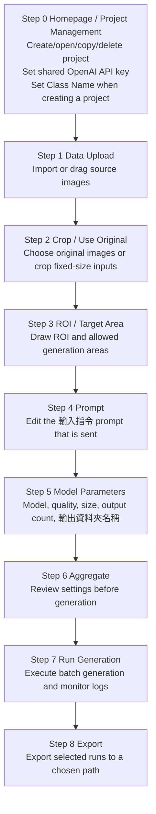

# GPT GenImage UI

`GPT GenImage UI` (defect mode) is a PySide6 desktop workflow for preparing
defect-image inputs, calling the OpenAI GPT Image API, and exporting generated results
as image datasets. The app is organized as a guided step-by-step UI and keeps
project-specific inputs, runs, and state under `project/<project_name>/`.

The current visible workflow has 9 steps: `Step 0` plus `Step 1` through `Step 8`.
Class Name is configured when a project is created in Step 0, and the OpenAI API key
is shared by all projects from Step 0. Key execution nodes and error/crash diagnostics
are written to a single shared `genui.log` at the repo root.

---

## 1. Install

### Windows

```bat
python -m venv .venv
.\.venv\Scripts\activate
python -m pip install --upgrade pip
python -m pip install -r requirements.txt
```

### Linux / macOS

```bash
python -m venv .venv
source .venv/bin/activate
python -m pip install --upgrade pip
python -m pip install -r requirements.txt
```

Required packages are listed in `requirements.txt` and include:

- `PySide6` for the desktop UI
- `openai` and `python-dotenv` for GPT Image API calls
- `pillow`, `numpy`, and `opencv-python` for image and mask processing

---

## 2. Launch

```bash
python launch_ui.py
```

Convenience launchers are also available:

```bat
quick_start_ui_windows.bat
```

```bash
bash quick_start_ui_linux.sh
```

If the launcher reports that `PySide6` or Qt cannot be imported, activate the same
virtual environment where `requirements.txt` was installed and run `python launch_ui.py`
again.

---

## 3. Current Workflow



The UI keeps older internal step indexes for compatibility with existing project
state files, but the visible sidebar and page titles now use the 9-step flow above.

---

## 4. Step Details

### Step 0: Homepage / Project Management

- Create a new project with both `Project Name` and `Class Name`.
- Save or replace the shared `OPENAI_API_KEY` used by all projects.
- Open, copy, or delete existing project cards.
- Project names must be unique.
- Selecting or switching a project keeps the page fixed: the project-card scroll
  position is preserved and the page does not jump.
- Reopening a project returns to Step 0 while preserving completed-step state and
  existing artifacts.

### Step 1: Data Upload

- Import source images through the file picker or drag-and-drop.
- `data/` contains exactly two folders, paired one-to-one by file stem: `raw_image/`
  (the clean input images, Image 1) and `reference_image/` (the annotation reference,
  Image 2). There are no `00_raw_images/`, `01_inputs/`, `masks/`, or `regions/`
  subfolders. Uploads go to `raw_image/`:

```text
project/<project_name>/data/raw_image/
```

### Step 2: Crop / Use Original

- Either use original images directly or crop fixed-size inputs.
- Cropping edits the clean images IN PLACE inside `data/raw_image/`. Existing
  generation runs are preserved when adding more inputs:

```text
project/<project_name>/data/raw_image/
```

### Step 3: ROI / Target Area

- Draw one or more ROI rectangles for original defect locations.
- Draw Target Area regions where new defects may be generated.
- Target Area supports rectangle and polygon drawing.
- In selection mode, ROI and rectangular Target Area boxes can be resized with corner
  and edge handles.
- This step auto-saves after edits. The ROI / Target Area geometry is stored in
  `project_state.json` (a `regions` map keyed by image stem); there are no separate
  `regions/`, `masks/`, or `target_area_masks/` files.
- Saving also writes an annotation reference image into `data/reference_image/`: a copy
  of the raw image with the ROI as a semi-transparent MAGENTA fill and the Target Area
  as a semi-transparent CYAN fill. The reference is paired one-to-one with its raw image
  by file stem and becomes Image 2 during generation:

```text
project/<project_name>/data/raw_image/        # Image 1: clean originals
project/<project_name>/data/reference_image/  # Image 2: ROI/Target Area annotation
```

Useful shortcuts in this step include:

- `R`: draw ROI
- `S`: select ROI
- `T`: draw rectangular Target Area
- `L`: draw polygon Target Area
- `Y`: select Target Area
- `A` / `D`: delete all / selected ROI
- `G` / `H`: delete all / selected Target Area
- `Up` / `Down`: switch image

### Step 4: Prompt

- This step contains only the `輸入指令` (prompt input) section, with an enlarged font.
  The old `引用組別` group multi-select, `Prompt 來源設定`, and `實際傳送指令` preview
  sections have been removed.
- The prompt that is sent equals the `輸入指令` text exactly. It is not combined with
  ROI / Target Area coordinate text; those positions are conveyed visually through the
  annotation-reference image (Image 2) during generation.
- Because group selection was removed, generation uses ALL images in `data/raw_image/`
  that have a matching `data/reference_image/`.
- The prompt actually sent for a run is recorded as `runs/<run_name>/prompt.txt`.

### Step 5: Model Parameters

Available models:

- `gpt-image-2`
- `gpt-image-1.5`
- `gpt-image-1`
- `gpt-image-1-mini`

The UI validates output size rules before generation. For `gpt-image-2`, output
dimensions must satisfy the current app checks, including 16-pixel multiples, valid
aspect ratio, and supported total pixel range. The output-folder field is labelled
`輸出資料夾名稱` (formerly `Run name`); it controls the folder name under `runs/<run_name>/`.

### Step 6: Aggregate

- Review the selected project, class, ROI/Target Area coverage, prompt, model, quality,
  size, output count, and `輸出資料夾名稱`.
- The aggregate summary is stored inside `project_state.json` (an `aggregate_summary`
  field). There is no per-project `logs/` folder.

### Step 7: Run Generation

- Executes `scripts/batch_from_folders.py`, which calls `scripts/run_gpt_image2.py`
  with `--workflow reference-guided-edit`. The backend makes ONE OpenAI Image Edit API
  call per matched tuple of (raw image + its reference image + prompt).
- Sends two images to GPT Image: Image 1 is the clean original (`data/raw_image/`);
  Image 2 is the ROI / Target Area annotation reference (`data/reference_image/`).
- Uses the shared Step 0 API key.
- ROI / Target Area coordinates are not sent in the prompt and are not used as an OpenAI
  API mask; the geometry is conveyed only by Image 2.
- Stop (`停止目前程序`) is a GRACEFUL PAUSE, not a kill: an in-flight image is allowed to
  finish (its API call and cost are not wasted) and the next image is not started. A
  `目前生成圖像尚在接收中...` dialog shows while the current image is received; when it is
  saved the dialog auto-closes and `現在生成至第 <N> 張，還剩 <M> 張尚未生成，已暫停` is
  shown. Mechanism: the UI writes a stop-sentinel file that the batch backend checks
  between images via `--stop-file`; the process is not killed.
- Generation outputs are written under (no `<class_name>` layer):

```text
project/<project_name>/runs/<run_name>/
```

Each run folder contains only `Gen_Images/`, `generation_summary.xlsx`
(`.csv` fallback if `openpyxl` is missing), and `prompt.txt`.

### Step 8: Export

- Exports the selected runs. Export opens a folder picker and copies the generated
  images straight to the chosen path (optionally packaged as a `.zip`); it does not
  write into a project `exports/` folder.

---

## 5. Project Files and Generated Artifacts

Runtime data lives under `project/` (ignored by Git at any depth). Git also ignores
`runs/`, `exports/`, the shared `genui.log` and any `logs/` folders, zip/tar archives,
and `.env` / key files.

A project folder contains EXACTLY `data/`, `runs/`, and `project_state.json` — no
`configs/`, `exports/`, `logs/`, or `_ui_state/`. `data/` holds `raw_image/` and
`reference_image/` (see Steps 1 and 3). `project_state.json` is the single source of
truth (completed-step state, the `regions` geometry map keyed by image stem, and the
`aggregate_summary`); the old per-mode `_ui_state/ui_state.json` and repo-root
`_launcher_state/launcher_state.json` are no longer written. There is no `configs/`
folder; OpenAI pricing is fetched live with a built-in default fallback and nothing is
cached to disk.

The main source files are:

```text
launch_ui.py                      # UI launcher
ui_gpt_defect/app.py              # Defect workflow PySide6 app
scripts/batch_from_folders.py     # Batch driver (graceful --stop-file pause)
scripts/run_gpt_image2.py         # GPT Image generation backend
scripts/verify_env.py             # Environment verification helper
```

---

## 6. Environment and Secrets

The UI stores the shared API key in `.env` as `OPENAI_API_KEY=...`.
The key preview shown in the UI is masked and should not be committed.

To verify Python syntax after code changes:

```bash
python -m compileall .
```

To inspect the current Git state before committing:

```bash
git status
git diff --stat
```
