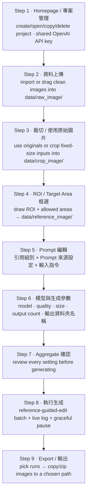

# GPT GenImage UI — Defect Mode

The **defect** workflow (`Gen Defect`) prepares clean images plus an annotation
reference, then uses the OpenAI GPT Image API to generate new defects guided by that
reference, and exports the results as an image dataset. It is one of the two modes
hosted by `launch_ui.py`; the shared Homepage and API key are described in the
[root README](../../README.md).

Defect mode uses the `reference-guided-edit` backend workflow: each call sends **two
images** — Image 1 (the clean original) and Image 2 (the ROI / Target Area annotation
reference) — plus the prompt. Per-project inputs, runs and state live under
`modes/defect/project/<project_name>/`, and key execution nodes / errors are written
to the shared repo-root `log.txt`.

---

## 1. Install & Launch

Install dependencies once (from the repository root):

```bash
python -m venv .venv
# Windows:        .\.venv\Scripts\activate
# Linux/macOS:    source .venv/bin/activate
python -m pip install --upgrade pip
python -m pip install -r requirements.txt
```

Launch the app and choose `Gen Defect` when creating a project:

```bash
python launch_ui.py
```

---

## 2. Visible Workflow (9 steps)



---

## 3. Step Details

### Step 1 — Homepage / 專案管理

- Create a project with `專案名稱` (project name) and `生成圖片物件的名稱` (the object
  name, used as the class name and the `{class_name}` prompt variable; defaults to
  the project name if blank).
- Save or replace the shared `OPENAI_API_KEY`. On a fresh install the field is empty
  until you enter and save a key; pressing Save with an empty field prompts
  `請輸入 API Key`.
- Open, copy or delete project cards (defect cards are green). Project names are
  unique, and selecting/switching a project does not reorder cards or jump the page.
- Copying a project duplicates its settings and uploaded images but **not** the
  generated `runs/`/`exports/`, so each project keeps an independent run counter (a
  copy starts at `run1`).

### Step 2 — 資料上傳 (Data Upload)

- Import images with the file picker or drag-and-drop; the most recently added image
  is previewed immediately.
- `data/` holds the staged uploads plus the prepared generation inputs. Uploads go
  to `raw_image/` (clean originals, untouched); the Step 4 input products land in
  `crop_image/` and their annotation references in `reference_image/`, paired
  one-to-one by file stem:

```text
modes/defect/project/<project_name>/data/raw_image/
```

### Step 3 — 裁切 / 使用原始圖片 (Crop / Use Original)

- Use the original images directly, or crop fixed-size inputs.
- The right-hand **`Step 4 輸入圖像`** list starts **empty** and only fills as you
  crop. Each click of the crop frame writes **one** cropped tile as a separate
  `<stem>_cropNNN` product into `data/crop_image/` and selects it in the preview, so
  you can keep cropping more tiles from the same original (連續裁切) without altering
  the upload in `data/raw_image/`. `使用原始圖片` instead copies whole originals into
  `data/crop_image/` as no-crop inputs.
- Switching a project that already holds whole-original inputs over to cropping warns
  **once** before the first crop (it discards those originals and their ROI/Target),
  not on every click. Existing generation runs are always preserved.

### Step 4 — ROI / Target Area 框選

- Draw one or more **ROI** rectangles over existing/original defect locations, and
  **Target Area** regions where new defects may be generated (rectangle or polygon).
- In selection mode, ROI and rectangular Target Area boxes can be resized with corner
  and edge handles. The step auto-saves after edits. Each actual **add or delete** of
  a box is written to `log.txt` with its `(x1,y1,x2,y2 …)` coordinates; merely
  selecting/viewing another framed image is **not** logged and does **not** change the
  sidebar step progress (only a real geometry edit marks Step 4 and the later steps as
  not-yet-run).
- The ROI/Target geometry is saved in the `project_index.json` record (the `regions`
  map, keyed by image stem) — there are no separate `regions/`, `masks/`, or
  `target_area_masks/` files. Because it is persisted, revisiting Step 4 (or
  reopening the project) restores exactly what you drew.
- Saving also renders an **annotation reference image** into `data/reference_image/`.
  It is drawn to look **identical to the Step 4 editor**: the ROI box is **red** and
  the Target Area box is **blue**, each a 3px **outline only with no fill** (so what
  you draw and what is sent to the API as Image 2 match). It is paired one-to-one with
  its Step 4 input image (`data/crop_image/`) by file stem and becomes **Image 2**
  during generation:

```text
modes/defect/project/<project_name>/data/raw_image/        # staged uploads (untouched)
modes/defect/project/<project_name>/data/crop_image/       # Image 1: Step 4 input products
modes/defect/project/<project_name>/data/reference_image/  # Image 2: ROI/Target Area annotation
```

Shortcuts: `R` draw ROI · `S` select ROI · `T` rectangle Target Area · `L` polygon
Target Area · `Y` select Target Area · `A`/`D` delete all/selected ROI · `G`/`H`
delete all/selected Target Area · `Up`/`Down` switch image.

### Step 5 — Prompt 編輯 (Prompt)

- Layout: `引用組別` (group multi-select with an `ALL` option; it lists the images that
  already have ROI + Target Area drawn), `Prompt 來源設定` (custom / template +
  `套用模板到輸入指令`), and the `輸入指令` input, which fills the width below with an
  enlarged font.
- Ctrl/Shift multi-select in `引用組別` (max **16** groups). The chosen groups are the
  exact images sent to generation, passed to the backend inline via
  `--selected-stems` (no stems file on disk). The list is **click-only**: clicking an
  empty area, or dragging anywhere inside it, never draws a rubber-band box and never
  changes the selection, so an accidental blank click or drag can no longer drop your
  chosen groups or reset the later steps to not-yet-run. Selection is changed only by
  clicking a card (plus Ctrl/Shift for multi-select).
- The prompt that is sent equals the `輸入指令` text exactly — ROI / Target Area
  positions are **not** added to the prompt text; they are conveyed visually through
  the annotation-reference image (Image 2). The prompt is recorded per run as
  `runs/<run_name>/prompt.txt`.

### Step 6 — 模型與生成參數 (Model Parameters)

- Models: `gpt-image-2`, `gpt-image-1.5`, `gpt-image-1`, `gpt-image-1-mini`.
- The UI validates output size rules before generation (for `gpt-image-2`: 16-pixel
  multiples, valid aspect ratio, supported total pixel range).
- `輸出資料夾名稱` (formerly `Run name`) sets the output folder name under
  `runs/<run_name>/`.

### Step 7 — Aggregate 確認

- Review the selected project, class, ROI / Target Area coverage, prompt, model,
  quality, size, output count and `輸出資料夾名稱` before generation is allowed.
- The summary is rebuilt live from the current settings and is not persisted (no
  per-project state file is written).

### Step 8 — 執行生成 (Run Generation)

- Runs `scripts/batch_from_folders.py`, which calls `scripts/run_gpt_image2.py` with
  `--workflow reference-guided-edit`. One OpenAI Image Edit API call is made per
  matched tuple of (input image + its reference image + prompt):
  - **Image 1** — Step 4 input image from `data/crop_image/` (a cropped tile, or a
    whole original copied in via `使用原始圖片`)
  - **Image 2** — ROI / Target Area annotation from `data/reference_image/`
- ROI / Target Area coordinates are not sent in the prompt and are not used as an
  OpenAI API mask; the geometry is conveyed only by Image 2.
- Uses the shared API key from Step 1; shows live logs and progress.
- `停止目前程序` is a **graceful pause, not a kill**: the in-flight image finishes (its
  API call/cost is not wasted) and the next is not started. A
  `目前生成圖像尚在接收中...` dialog shows while the current image is received; when it is
  saved, the dialog closes and `現在生成至第 <N> 張，還剩 <M> 張尚未生成，已暫停` is shown.
  Mechanism: the UI sends a `STOP` line on the batch process's stdin (no sentinel
  file; the process is not killed).
- Outputs (no `<class_name>` layer):

```text
modes/defect/project/<project_name>/runs/<run_name>/
├── Gen_Images/               # every generated image for this run
├── generation_summary.xlsx   # per-image table (.csv fallback if openpyxl missing)
└── prompt.txt                # the prompt actually sent for this run
```

### Step 9 — Export / 輸出

- `匯出範圍` is a checkable multi-select dropdown listing every run plus
  `全部 runs（包含歷次 runs）`. `確認` loads the selected runs' images into the preview.
- `Export` opens a folder picker and copies the images to `<project_name>-<timestamp>`
  at the chosen path; with `打包成 .zip` ticked it produces
  `<project_name>-<timestamp>.zip` instead. Nothing is written into a project
  `exports/` folder.

---

## 4. Files & Artifacts

```text
launch_ui.py                      # launcher + single-window host (repo root)
ui_gpt_defect/app.py              # Defect workflow PySide6 app
scripts/batch_from_folders.py     # batch driver (graceful stdin STOP pause)
scripts/run_gpt_image2.py         # GPT Image generation backend (reference-guided-edit)
scripts/verify_env.py             # environment verification helper
```

- A project folder holds exactly `data/` (`raw_image/` + `crop_image/` +
  `reference_image/`) and `runs/` — no per-project state file is written (no `project_state.json`, `configs/`,
  `exports/`, `logs/`, or `_ui_state/`). Projects are listed from a single
  `modes/defect/project/project_index.json` registry, which also stores each project's
  per-step completion flags and ROI/Target `regions` geometry, so reopening restores
  the exact step progress and annotations.
- Runtime data under `modes/defect/project/` is Git-ignored (via the root
  `.gitignore`), along with `log.txt`, `.env`, and export archives. The shared API
  key lives in a single `.env` at the repository root (same level as `modes/`, shared
  by both modes) as `OPENAI_API_KEY=...` and is never committed.
