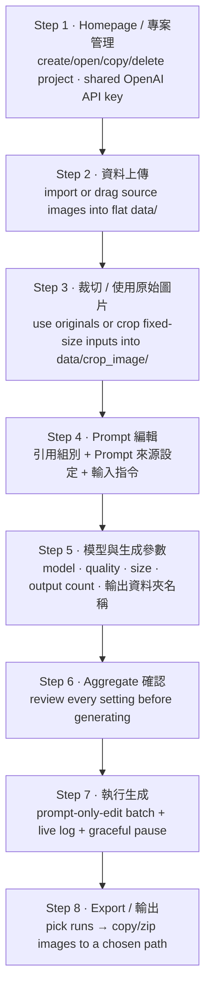

# GPT GenImage UI — Food Mode

The **food** workflow (`Gen Food`) prepares food images and uses the OpenAI GPT
Image API to generate appearance / placement variations from a text prompt, then
exports the results as an image dataset. It is one of the two modes hosted by
`launch_ui.py`; the shared Homepage and API key are described in the
[root README](../../README.md).

Food mode uses the `prompt-only-edit` backend workflow: each call sends **one input
image plus the text prompt** (no mask, no reference image). Per-project inputs, runs
and state live under `modes/food/project/<project_name>/`, and key execution nodes /
errors are written to the shared repo-root `log.txt`.

---

## 1. Install & Launch

Install dependencies once (from the repository root):

```bash
python -m venv .venv
# Windows:        .\.venv\Scripts\activate
# Linux/macOS:    source .venv/bin/activate
python -m pip install --upgrade pip
python -m pip install -r requirements.txt
```

Launch the app and choose `Gen Food` when creating a project:

```bash
python launch_ui.py
```

---

## 2. Visible Workflow (8 steps)



---

## 3. Step Details

### Step 1 — Homepage / 專案管理

- Create a project with `專案名稱` (project name) and `生成圖片物件的名稱` (the object
  name, used as the class name and the `{class_name}` prompt variable; defaults to
  the project name if blank).
- Save or replace the shared `OPENAI_API_KEY`. On a fresh install the field is empty
  until you enter and save a key; pressing Save with an empty field prompts
  `請輸入 API Key`.
- Open, copy or delete project cards (food cards are blue). Project names are unique,
  and selecting/switching a project does not reorder cards or jump the page.
- Copying a project duplicates its settings and uploaded images but **not** the
  generated `runs/`/`exports/`, so each project keeps an independent run counter (a
  copy starts at `run1`).

### Step 2 — 資料上傳 (Data Upload)

- Import images with the file picker or drag-and-drop; the most recently added image
  is previewed immediately.
- `data/` is a **flat** folder that holds the uploaded images directly (no
  `00_raw_images/`, `01_inputs/`, `masks/`, or `regions/` subfolders); the only
  subfolder is `crop_image/`, which holds the prepared Step 4 input products:

```text
modes/food/project/<project_name>/data/             # uploaded originals (untouched)
modes/food/project/<project_name>/data/crop_image/  # Step 4 input products (sent to the API)
```

### Step 3 — 裁切 / 使用原始圖片 (Crop / Use Original)

- Use the original images directly, or crop fixed-size inputs.
- The right-hand **`Step 4 輸入圖像`** list starts **empty** and only fills as you
  crop. Each click of the crop frame writes **one** cropped tile as a separate
  `<stem>_cropNNN` product into `data/crop_image/` and selects it in the preview, so
  you can keep cropping more tiles from the same original (連續裁切) without altering
  the upload in `data/`. `使用原始圖片` instead copies whole originals into
  `data/crop_image/` as no-crop inputs; switching existing originals over to cropping
  warns **once** before the first crop, not on every click. Existing generation runs
  are preserved.
- Cropping is continuous: after a click the just-made frame stays on the image and the
  cursor immediately shows the next hover frame, so you can click again to take the next
  tile. Clicking a finished tile in `Step 4 輸入圖像` (or wheel-scrolling the list)
  reloads its source image in the middle view with the exact crop frame that produced it
  (recorded in `data/crop_records.json`). `刪除選取裁切圖` / `刪除所有裁切圖` remove the
  selected or all input products (the `data/` uploads stay).

### Step 4 — Prompt 編輯 (Prompt)

- Layout: `引用組別` (group multi-select with an `ALL` option), `Prompt 來源設定`
  (custom / template + `套用模板到輸入指令`), and the `輸入指令` input. The `輸入指令`
  section fills the width below with an enlarged font.
- `Prompt 模式` chooses between `自訂 prompt` and `使用模板`. In template mode, press
  `套用模板到輸入指令` to drop the preset instruction into `輸入指令`; switching the field
  back to `自訂 prompt` automatically clears `輸入指令` so you start your custom prompt
  from a blank box (a saved prompt reopened from a project is **not** cleared).
- Ctrl/Shift multi-select in `引用組別` (max **16** groups). The chosen groups are the
  exact images sent to generation, passed to the backend inline via
  `--selected-stems` (no stems file is written to disk). The list is **click-only**:
  clicking an empty area, or dragging anywhere inside it, never draws a rubber-band box
  and never changes the selection, so an accidental blank click or drag can no longer
  drop your chosen groups or reset the later steps to not-yet-run. Selection is changed
  only by clicking a card (plus Ctrl/Shift for multi-select).
- The prompt that is sent equals the `輸入指令` text exactly, and is recorded per run
  as `runs/<run_name>/prompt.txt`.

### Step 5 — 模型與生成參數 (Model Parameters)

- Models: `gpt-image-2`, `gpt-image-1.5`, `gpt-image-1`, `gpt-image-1-mini`.
- The UI validates output size rules before generation (for `gpt-image-2`: 16-pixel
  multiples, valid aspect ratio, supported total pixel range).
- `輸出資料夾名稱` (formerly `Run name`) sets the output folder name under
  `runs/<run_name>/`.

### Step 6 — Aggregate 確認

- Review the selected project, class, prompt, model, quality, size, output count and
  `輸出資料夾名稱` before generation is allowed. The summary is rebuilt live from the
  current settings and is not persisted (no per-project state file is written).

### Step 7 — 執行生成 (Run Generation)

- Runs `scripts/batch_from_folders.py`, which calls `scripts/run_gpt_image2.py` with
  `--workflow prompt-only-edit`: Image 1 is the input image plus the text prompt (no
  mask, no reference image). One OpenAI Image Edit API call is made per image.
- Uses the shared API key from Step 1; shows live logs and progress.
- `停止目前程序` is a **graceful pause, not a kill**: the in-flight image finishes (its
  API call/cost is not wasted) and the next is not started. A
  `目前生成圖像尚在接收中...` dialog shows while the current image is received; when it is
  saved, the dialog closes and `現在生成至第 <N> 張，還剩 <M> 張尚未生成，已暫停` is shown.
  Mechanism: the UI sends a `STOP` line on the batch process's stdin (no sentinel
  file; the process is not killed).
- Outputs (no `<class_name>` layer):

```text
modes/food/project/<project_name>/runs/<run_name>/
├── Gen_Images/               # every generated image for this run
├── generation_summary.xlsx   # per-image table (.csv fallback if openpyxl missing)
└── prompt.txt                # the prompt actually sent for this run
```

### Step 8 — Export / 輸出

- `匯出範圍` is a checkable multi-select dropdown listing every run plus
  `全部 runs（包含歷次 runs）`. `確認` loads the selected runs' images into the preview.
- `Export` opens a folder picker and copies the images to `<project_name>-<timestamp>`
  at the chosen path; with `打包成 .zip` ticked it produces
  `<project_name>-<timestamp>.zip` instead. Nothing is written into a project
  `exports/` folder.

---

## 4. Files & Artifacts

```text
launch_ui.py                      # launcher + single-window host (repo root)
ui_gpt_food/app.py                # Food workflow PySide6 app
scripts/batch_from_folders.py     # batch driver (graceful stdin STOP pause)
scripts/run_gpt_image2.py         # GPT Image generation backend (prompt-only-edit)
scripts/verify_env.py             # environment verification helper
```

- A project folder holds exactly `data/` and `runs/` — no per-project state file is
  written (no `project_state.json`, `configs/`, `exports/`, `logs/`, or `_ui_state/`).
  Projects are listed from a single `modes/food/project/project_index.json` registry,
  which also stores each project's per-step completion flags so reopening restores the
  exact step progress. Returning to an earlier completed step to view or select an
  existing input does not change progress; only actually re-editing that step's
  products marks it and every later step as not-yet-run.
- Runtime data under `modes/food/project/` is Git-ignored (via the root
  `.gitignore`), along with `log.txt`, `.env`, and export archives.
- The shared API key lives in a single `.env` at the repository root (same level as
  `modes/`, shared by both modes) as `OPENAI_API_KEY=...` and is never committed.
