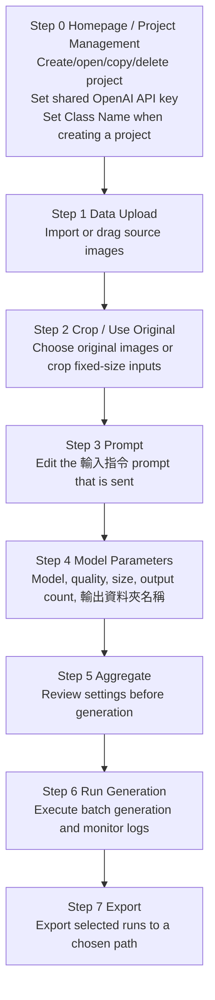

# GPT GenImage UI

`GPT GenImage UI` (food mode) is a PySide6 desktop workflow for preparing food-image
inputs, calling the OpenAI GPT Image API, and exporting generated results as image
datasets. The app is organized as a guided step-by-step UI and keeps project-specific
inputs, runs, and state under `project/<project_name>/`.

Class Name is configured when a project is created, and the OpenAI API key is shared
by all projects from the homepage. Key execution nodes and error/crash diagnostics
are written to a single shared `genui.log` at the repo root.

---

## 1. Install

### Windows

```bat
python -m venv .venv
.\.venv\Scripts\activate
python -m pip install --upgrade pip
python -m pip install -r requirements.txt
```

### Linux / macOS

```bash
python -m venv .venv
source .venv/bin/activate
python -m pip install --upgrade pip
python -m pip install -r requirements.txt
```

Required packages are listed in `requirements.txt` and include:

- `PySide6` for the desktop UI
- `openai` and `python-dotenv` for GPT Image API calls
- `pillow`, `numpy`, and `opencv-python` for image and mask processing

---

## 2. Launch

```bash
python launch_ui.py
```

Convenience launchers are also available:

```bat
quick_start_ui_windows.bat
```

```bash
bash quick_start_ui_linux.sh
```

If the launcher reports that `PySide6` or Qt cannot be imported, activate the same
virtual environment where `requirements.txt` was installed and run `python launch_ui.py`
again.

---

## 3. Current Workflow



The UI keeps older internal step indexes for compatibility with existing project
state files, but the visible sidebar and page titles now use the 8-step flow above.

---

## 4. Step Details

### Step 0: Homepage / Project Management

- Create a new project with both `Project Name` and `Class Name`.
- Save or replace the shared `OPENAI_API_KEY` used by all projects.
- Open, copy, or delete existing project cards.
- Project names must be unique.
- Selecting or switching a project keeps the page fixed: the project-card scroll
  position is preserved and the page does not jump.
- Reopening a project returns to Step 0 while preserving completed-step state and
  existing artifacts.

### Step 1: Data Upload

- Import source images through the file picker or drag-and-drop.
- `data/` is a FLAT folder that holds the input images directly. There are no
  `00_raw_images/`, `01_inputs/`, `masks/`, or `regions/` subfolders.
- Uploaded originals are stored under:

```text
project/<project_name>/data/
```

### Step 2: Crop / Use Original

- Either use original images directly or crop fixed-size inputs.
- Cropping edits images IN PLACE inside `data/`; it does not create a separate inputs
  tree. Existing generation runs are preserved when adding more inputs.
- Prepared inputs stay under:

```text
project/<project_name>/data/
```

### Step 3: Prompt

- The original layout is kept: `引用組別` (group multi-select with an `ALL` option),
  `Prompt 來源設定` (custom / template + `套用模板到輸入指令`), and the `輸入指令` section.
  Only the `實際傳送指令` preview was removed; `輸入指令` now fills the width below with an
  enlarged font.
- Use Ctrl/Shift multi-select in `引用組別` (max 16 groups); the chosen groups are the
  images sent to generation (selected-stems file written under `runs/`, not `data/`).
- The prompt that is sent equals the `輸入指令` text exactly.
- The prompt actually sent for a run is recorded as `runs/<run_name>/prompt.txt`.

### Step 4: Model Parameters

Available models:

- `gpt-image-2`
- `gpt-image-1.5`
- `gpt-image-1`
- `gpt-image-1-mini`

The UI validates output size rules before generation. For `gpt-image-2`, output
dimensions must satisfy the current app checks, including 16-pixel multiples, valid
aspect ratio, and supported total pixel range. The output-folder field is labelled
`輸出資料夾名稱` (formerly `Run name`); it controls the folder name under `runs/<run_name>/`.

### Step 5: Aggregate

- Review the selected project, class, prompt, model, quality, size, output count, and
  `輸出資料夾名稱`.
- The aggregate summary is stored inside `project_state.json` (an `aggregate_summary`
  field). There is no per-project `logs/` folder.

### Step 6: Run Generation

- Executes `scripts/batch_from_folders.py`, which calls `scripts/run_gpt_image2.py`
  with `--workflow prompt-only-edit`: Image 1 is the input image plus the text prompt
  (no mask, no reference image).
- Uses the shared API key from the homepage.
- Stop (`停止目前程序`) is a GRACEFUL PAUSE, not a kill: an in-flight image is allowed
  to finish (its API call and cost are not wasted) and the next image is not started.
  A `目前生成圖像尚在接收中...` dialog shows while the current image is received; when it
  is saved the dialog auto-closes and `現在生成至第 <N> 張，還剩 <M> 張尚未生成，已暫停`
  is shown. Mechanism: the UI writes a stop-sentinel file that the batch backend checks
  between images via `--stop-file`; the process is not killed.
- Generation outputs are written under (no `<class_name>` layer):

```text
project/<project_name>/runs/<run_name>/
```

Each run folder contains only `Gen_Images/`, `generation_summary.xlsx`
(`.csv` fallback if `openpyxl` is missing), and `prompt.txt`.

### Step 7: Export

- Exports the selected runs. Export opens a folder picker and copies the generated
  images straight to the chosen path (optionally packaged as a `.zip`); it does not
  write into a project `exports/` folder.

---

## 5. Project Files and Generated Artifacts

Runtime data lives under `project/` (ignored by Git at any depth). Git also ignores
`runs/`, `exports/`, the shared `genui.log` and any `logs/` folders, zip/tar archives,
and `.env` / key files.

A project folder contains EXACTLY `data/`, `runs/`, and `project_state.json` — no
`configs/`, `exports/`, `logs/`, or `_ui_state/`. `project_state.json` is the single
source of truth (completed-step state and the `aggregate_summary`); the old per-mode
`_ui_state/ui_state.json` and repo-root `_launcher_state/launcher_state.json` are no
longer written. There is no `configs/` folder; OpenAI pricing is fetched live with a
built-in default fallback and nothing is cached to disk.

The main source files are:

```text
launch_ui.py                      # UI launcher
ui_gpt_defect/app.py              # Food workflow PySide6 app
scripts/batch_from_folders.py     # Batch driver (graceful --stop-file pause)
scripts/run_gpt_image2.py         # GPT Image generation backend
scripts/verify_env.py             # Environment verification helper
```

---

## 6. Environment and Secrets

The UI stores the shared API key in `.env` as `OPENAI_API_KEY=...`.
The key preview shown in the UI is masked and should not be committed.

To verify Python syntax after code changes:

```bash
python -m compileall .
```

To inspect the current Git state before committing:

```bash
git status
git diff --stat
```
